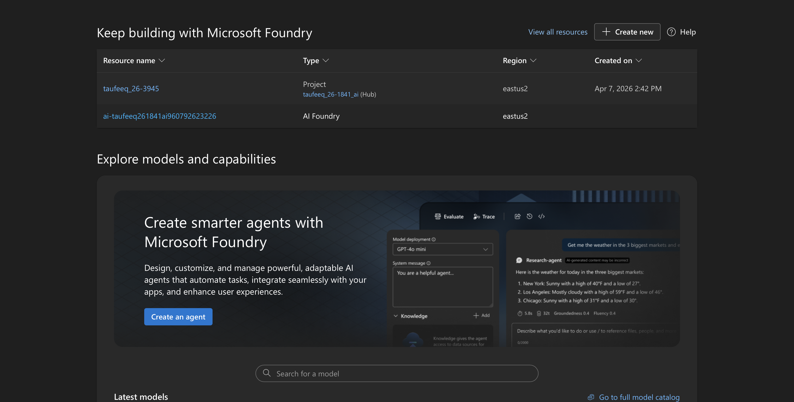
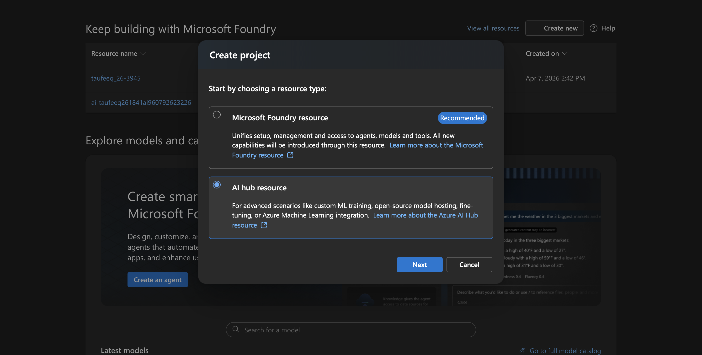
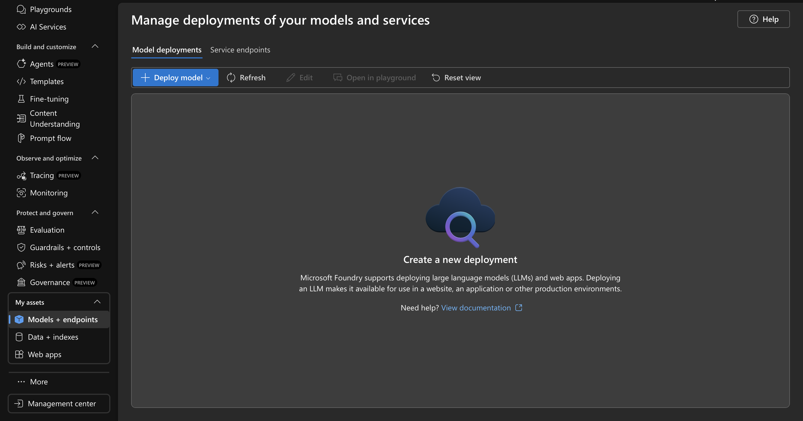

# Azure Setup Guide

This guide will walk you through setting up the Azure AI environment.

### Step 1: Create an AI Foundry Project
1. Navigate to the Azure AI Foundry portal.
2. Click on **Create a project**.

3. Follow the prompts to create an AI Hub and your Project.


### Step 2: Deploy an AI Model
1. In your new Project, click on the **Models + Endpoints** tab in the left sidebar.

2. Click on **Deploy model** (specifically, Deploy base model).
3. Select and deploy the **`gpt-4o`** model (it's fast, cost-effective, and perfect for this project).
5. Wait for the model to finish deploying (usually takes 2-3 minutes).

### Step 3: Upload Data & Create Index
You don't need to manually create storage accounts! Azure AI Foundry can handle the storage and indexing directly from the Data tab.

1. In your Azure AI Foundry project, click on **Data + index** (or **Data**) in the left sidebar.
2. Click the **+ New data** button and select **Upload files/folders** as your source.
3. Drag and drop the 4 `.json` files from your local `data/` folder directly into the upload dialog.
4. Proceed to the indexing step. Azure will prompt you to connect an **Azure AI Search** resource. Click the link to **Create a new Azure AI Search resource** (this opens in a new tab).
5. In the Azure Portal tab, choose the **Basic** pricing tier (required for robust indexing), give the search resource a name (e.g., `student-data-search`), and click **Review + Create**.
6. Once deployed, return to the Foundry tab, hit refresh, and select your newly created AI Search service.
7. Provide an **Index Name** (e.g., `explore-texas-index`) and complete the wizard. Azure will automatically provision a secure storage container, upload your JSONs, and map the keys!

### Step 4: Connect Your Application
Your cloud resources are completely set up! Now just tell the local application where to point.
1. Open the `backend/.env` file in this repository.
2. Fill in your Foundry Model credentials (found under Project Settings -> Connection details in AI Foundry):
   ```env
   AZURE_FOUNDRY_BASE_URL="https://<your-project-endpoint>.services.ai.azure.com/openai/v1/"
   AZURE_FOUNDRY_API_KEY="<your-api-key>"
   AZURE_FOUNDRY_MODEL_DEPLOYMENT="gpt-4o" # The deployment name from Step 2
   ```
3. Fill in your Azure AI Search credentials (found in the Azure Portal by going to your new AI Search resource -> **Keys**):
   ```env
   AZURE_SEARCH_ENDPOINT="https://<your-search-name>.search.windows.net"
   AZURE_SEARCH_API_KEY="<your-search-key>"
   AZURE_SEARCH_INDEX_PREFIX="explore-texas-index" # The exact index name from Step 4
   ```
4. Start your application!
   Open a terminal, navigate to the `backend/` folder, and simply run:
   ```bash
   npm install
   npm run dev
   ```

Your new Node.js backend is now fully integrated with Azure AI Foundry and securely grounded to act **only** on the data you uploaded!
